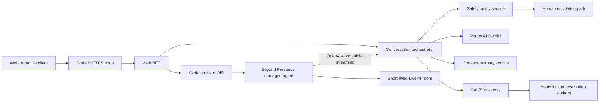

# NewChapter production architecture

## Purpose

NewChapter is a safety-first emotional wellness platform for adults processing
heartbreak. It helps users relate to painful thoughts with less urgency and
choose healthy next actions. It does not diagnose, provide therapy, promise
reconciliation, or claim to erase memories.

## System boundaries

### Web BFF

- Owns browser authentication, rate limits, request validation, and streaming.
- Uses service identity to call private backend services.
- Never exposes Vertex AI, Beyond Presence, or LiveKit server credentials.
- Falls back to a limited deterministic response if the orchestrator is
  unavailable; the fallback still runs explicit crisis phrase routing.

### Conversation orchestrator

- Stateless Cloud Run service with horizontally scalable instances.
- Runs deterministic safety triage before any model call.
- Executes listener, reframe, and next-step specialists concurrently.
- Composes one response and applies a final care review.
- Uses a `ModelGateway` port so Vertex AI can be changed without rewriting the
  domain workflow.
- Adds Model Armor before and after Gemini in production.

### Live presence

- The web BFF creates Beyond Presence calls without exposing the provider key.
- Beyond Presence owns speech recognition, voice synthesis, and avatar media.
- Its managed agent calls the orchestrator through the authenticated
  OpenAI-compatible streaming endpoint.
- The browser receives only a short-lived LiveKit room URL and participant
  token, then renders the remote avatar track with the official LiveKit client.
- Accounts without programmatic-call entitlement fall back to Beyond
  Presence's official `bey.chat` iframe embed; upgrading the provider plan
  automatically unlocks the native LiveKit path without a client rewrite.
- The orchestrator remains the source of truth for prompts, safety decisions,
  memory policy, and conversation behavior.

### Data platform

- AlloyDB for user profiles, consent, durable conversation summaries, and
  recovery plans.
- Memorystore for short-lived session state, distributed rate limits, and
  idempotency keys.
- Pub/Sub for analytics, evaluation, and notification events.
- Cloud Storage for policy-approved exports with lifecycle deletion.
- BigQuery receives de-identified product events, never raw private journals by
  default.

## Agent flow

1. Validate identity, consent, quota, and message size.
2. Sanitize the request with Model Armor and sensitive-data rules.
3. Run deterministic safety triage.
4. For immediate risk, bypass every generative agent and return the controlled
   safety response with human-escalation options.
5. For normal or elevated support, gather bounded contributions from the deep
   listener, reframe guide, and next-step coach concurrently.
6. Compose one concise response.
7. Review for diagnosis, coercion, dependency, revenge, surveillance, promises,
   and unsafe instructions.
8. Sanitize the response again, emit an audit event, and stream it to the user.
9. Send only reviewed audio to the avatar renderer.

## Reliability targets

| Signal | Initial production target |
| --- | --- |
| Web and orchestrator availability | 99.9% monthly |
| Text response p95 | below 4 seconds |
| Safety override execution | below 250 ms |
| Avatar join p95 | below 8 seconds |
| Recovery point objective | 15 minutes |
| Recovery time objective | 60 minutes |

All requests use trace IDs, deadlines, bounded retries with jitter, idempotency
keys for session creation, and circuit breakers around external providers.
Provider failure degrades to text; safety failure closes the normal agent path.

## Security and privacy

- Identity Platform or Firebase Authentication for external users.
- Least-privilege service accounts per deployable service.
- Secrets in Secret Manager and workload identity in runtime.
- Private backend ingress, VPC Service Controls, Cloud Armor, and audit logs.
- Explicit opt-in before durable memory; delete and export workflows are
  first-class APIs.
- Separate operational logs from conversation content.
- No training on private user conversations without separate informed consent.
- Adults-only launch until a dedicated minor-safety design is reviewed.

## Deployment topology

Start with regional Cloud Run services behind a global load balancer. Keep the
services stateless so a second region can be added without redesign. Use
provisioned Vertex AI throughput only after measured demand. LiveKit can run as
managed cloud initially and move behind a dedicated deployment if residency or
economics require it.

## Why this is not a single chatbot

The web UI, safety policy, orchestration, model provider, memory, and avatar
renderer are independent boundaries. Each can scale, fail, deploy, and be
audited separately. The product presents one coherent companion while the
platform keeps specialized responsibilities isolated.
